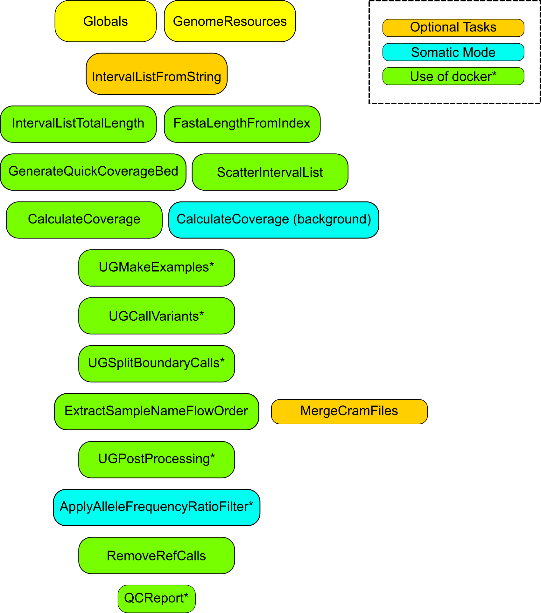

## Efficient DV (GSI mod)

This repository contains modified code of Ultima Genomics efficient_dv workflow ().
This workflow runs on Ultima NGS data and is capable of calling small variants (SNVs) in either germline or somatic modes. Please consider this repository as a work in progress project as not all of it's elements have been thoroughly tested in production environment.

### Strusture of the workflow

The diagram below outlines the connections between tasks and resource modules with outputs specific to each of two modes listed in a table, also see below

### Outputs

Output|Type|Description
---|---|---
`nvidia_smi_log`|File|nvidia GPU run log
`output_vcf`|File|vcf file with calls, either germline or somatic
`output_vcf_index`|File|index of the output vcf file
`vcf_no_ref_calls`|File|output vcf file with reference calls removed
`vcf_no_ref_calls_index`|File| = RemoveRefCalls.output_vcf_index
`output_gvcf`|File?|Optional GVCF file
`output_gvcf_index`|File?|Optional index of GVCF file
`output_gvcf_hcr`|File?|Optional HCR file for GVCF
`realigned_cram`|File?|Optional realigned CRAM file
`realigned_cram_index`|File?|Optional index of realigned CRAM
`report_html`|File|QC report file, HTML
`qc_h5`|File|QC report output, h5 file
`qc_metrics_h5`|File|QC report output, metrics h5 file

### Setting up to run in production environment

Efficient DV uses multiple resources which may be downloaded from Ultima Genomics website(s) and Amazon buckets. A simple bash script is included, although in the nearest future we may switch to using efficient_dv resources wrapped in modules (with Modulator). 

